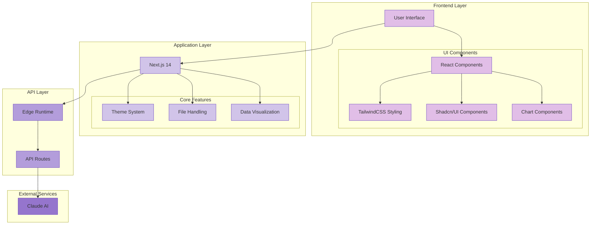

# Finance AI Technical Architecture

## System Architecture Diagram

## Technology Stack Details

### Frontend
- **Framework**: Next.js 14 (React 18)
- **Styling**: 
  - TailwindCSS
  - Shadcn/UI Components
  - Custom theme system with dark/light mode
- **Data Visualization**: 
  - Recharts library
  - Custom chart components
- **State Management**: React Hooks
- **File Handling**:
  - PDF.js for PDF processing
  - Base64 encoding for images
  - Text file processing

### Backend
- **Runtime**: Edge Runtime
- **API Routes**: Next.js API Routes
- **AI Integration**: Anthropic Claude API
  - Claude 3 Haiku
  - Claude 3.5 Sonnet

### Development Tools
- **Language**: TypeScript
- **Package Manager**: npm
- **Development Environment**:
  - ESLint
  - PostCSS
  - Environment variables

### Key Features
1. **Intelligent Analysis**
   - Financial data processing
   - Natural language understanding
   - Automated chart generation

2. **File Support**
   - CSV data
   - PDF documents
   - Images
   - Text/Code files

3. **Visualization Types**
   - Line Charts
   - Bar Charts
   - Multi-Bar Charts
   - Area Charts
   - Stacked Area Charts
   - Pie Charts

4. **UI/UX**
   - Responsive design
   - Dark/Light theme
   - Interactive chat interface
   - Real-time updates
   - Toast notifications
   - Loading states

## Security Features
- Environment variable protection
- API key security
- Edge runtime isolation
- Client-side file processing
- Secure data transmission 